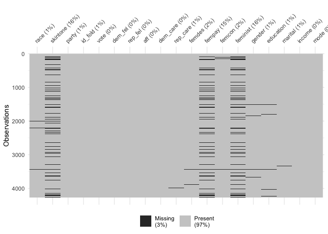

<!-- ========== NAVIGATION BAR ========== -->
<nav class="nav">
  <a href="index.html">Home</a>
  <a href="about.html">About Me</a>
  <a href="education.html">Education</a>
  <a href="work_history.html">Work History</a>
  <a href="projects.html">Projects</a>
</nav>

<!-- ========== ICONS ========== -->

  
  

<!-- ========== HERO SECTION ========== -->
<section class="hero">
  
  <h1 class="hero-title">Adaline Powell</h1>
  
Data Scientist •Political Scientist • Researcher

  <a href="resume.pdf" target="_blank" class="resume-btn">Download Résumé</a>
</section>

<!-- ========== ABOUT ========== -->
<section class="about">
  <h2>Welcome</h2>
  

    I’m a political scientist and data scientist with experience in
    statistical modeling, spatial analysis, and data visualization.
    I use R, Python, ArcGIS, and machine learning techniques to answer complex questions.
  

</section>

<!-- ========== PROJECTS ========== -->
<h2 style="text-align:center;">Featured Projects</h2>

  <a href="negotiations.html">
    
    
Predicting Negotiation Outcomes

  </a>

  <a href="variableimportance.html">
    
    
Variable Importance ML Visualization

  </a>

  <a href="Missingness.html">
    
    
Missingness Diagnostics

  </a>

<!-- ========== SKILLS ========== -->
<h2 style="text-align:center;">Skills & Tools</h2>

  

    <h3>Programming</h3>
    <ul>
      <li>R & RStudio</li>
      <li>Python</li>
      <li>Stata</li>
      <li>SPSS</li>
      <li>Excel (Advanced)</li>
    </ul>
  

  

    <h3>Modeling</h3>
    <ul>
      <li>Regression (OLS, Logistic, Multinomial)</li>
      <li>Predictive Modeling</li>
      <li>Machine Learning (Foundational)</li>
      <li>Bayesian Modeling</li>
    </ul>
  

  

    <h3>Tools</h3>
    <ul>
      <li>ArcGIS</li>
      <li>GitHub</li>
      <li>Quarto / R Markdown</li>
      <li>SQL (Basic)</li>
    </ul>
  

<footer class="footer">
  © 2025 Adaline Powell • Data & Political Science
</footer>
