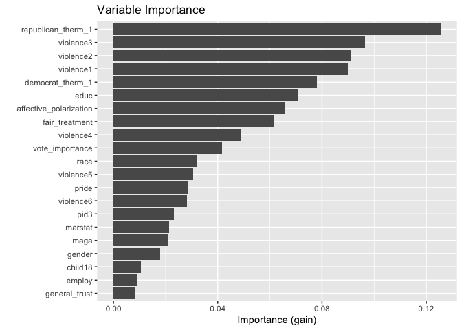

# Welcome

Hi, I'm Adaline Powell! Currently I am a master’s student in data science at UW Milwaukee. This site showcases some of my projects and visualizations!

## Featured Projects

---

[About Me →](about.html)
